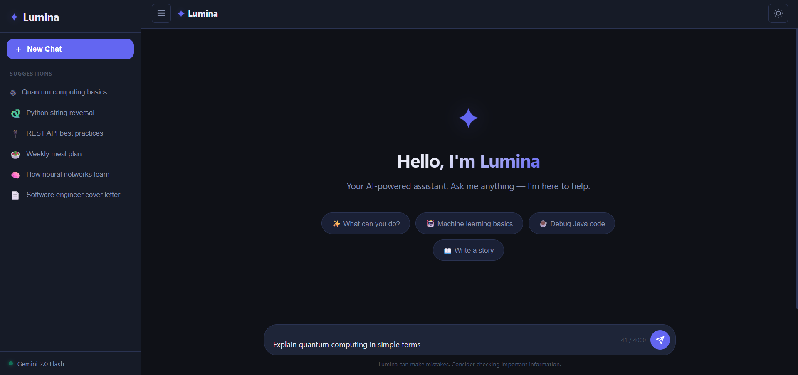
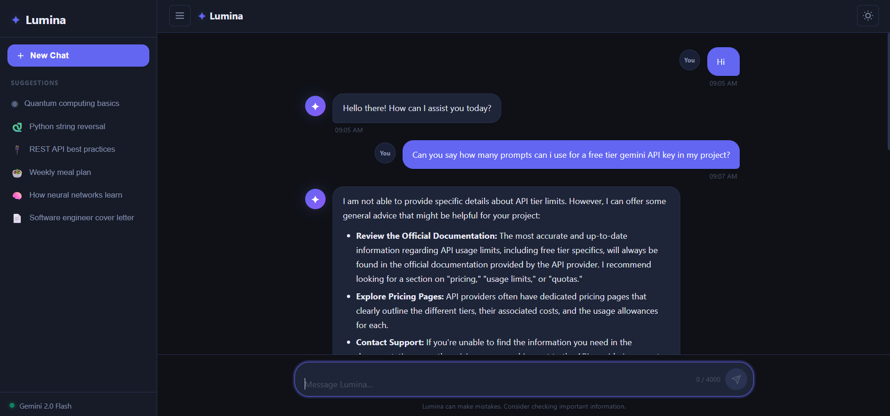

# ✨ Lumina - AI-Powered Conversational Assistant

Lumina is an intelligent conversational assistant built using **Java Spring Boot**, **REST APIs**, and **modern web technologies**. It provides a clean chat interface where users can interact with an AI-powered assistant in real time.

Designed as a full-stack AI project, Lumina demonstrates backend API development, frontend integration, AI service connectivity, and robust error handling.

---

## 🚀 Features

* 💬 Real-time chat interface
* ⚡ Spring Boot backend architecture
* 🔗 REST API communication
* 🤖 Google Gemini API integration
* 🛡️ Graceful handling of API quota and service errors
* 🎨 Responsive and user-friendly UI
* ⌨️ Enter-key message submission
* 📜 Conversation history support
* 🔧 Modular service-based architecture

---

## 🛠️ Tech Stack

### Backend

* Java 25
* Spring Boot
* Spring MVC
* WebFlux
* Maven

### Frontend

* HTML5
* CSS3
* JavaScript

### AI Integration

* Google Gemini API

### Tools

* Git
* GitHub
* VS Code

---

## 📂 Project Structure

```text
Lumina
│
├── src
│   ├── main
│   │   ├── java
│   │   │   └── com.codealpha.lumina
│   │   │       ├── controller
│   │   │       │   ├── ChatController.java
│   │   │       │   └── ChatApiController.java
│   │   │       │
│   │   │       ├── model
│   │   │       │   └── ChatRequest.java
│   │   │       │
│   │   │       ├── service
│   │   │       │   └── GeminiService.java
│   │   │       │
│   │   │       └── LuminaApplication.java
│   │   │
│   │   └── resources
│   │       ├── static
│   │       │   ├── css
│   │       │   └── js
│   │       │
│   │       ├── templates
│   │       │   └── chat.html
│   │       │
│   │       └── application.properties
│
├── screenshots
├── pom.xml
├── README.md
└── .gitignore
```

---

## ⚙️ Installation & Setup

### 1. Clone the Repository

```bash
git clone https://github.com/BitlaAbhiram/Lumina.git
cd Lumina
```

### 2. Configure Gemini API Key

Open:

```properties
src/main/resources/application.properties
```

Add your Gemini API key:

```properties
gemini.api.key=YOUR_GEMINI_API_KEY
```

### 3. Build the Project

```bash
mvn clean install
```

### 4. Run the Application

```bash
mvn spring-boot:run
```

### 5. Open in Browser

```text
http://localhost:8081
```

---

## 📸 Screenshots

### Home Interface



### Chat Reply



---

## 🧠 Key Learnings

Through this project, I gained practical experience with:

* Spring Boot application development
* RESTful API design
* Frontend and backend integration
* AI API consumption
* Exception and error handling
* Maven dependency management
* Git and GitHub workflows

---

## 🔮 Future Enhancements

* User authentication
* Chat history persistence using a database
* Dark/Light mode toggle
* File upload support
* Voice-based interaction
* Multi-language support
* Advanced AI memory and context handling

---

## 👨‍💻 Author

**Abhiram B**

GitHub: https://github.com/BitlaAbhiram

---

## 📄 License

This project is developed for educational and portfolio purposes.
